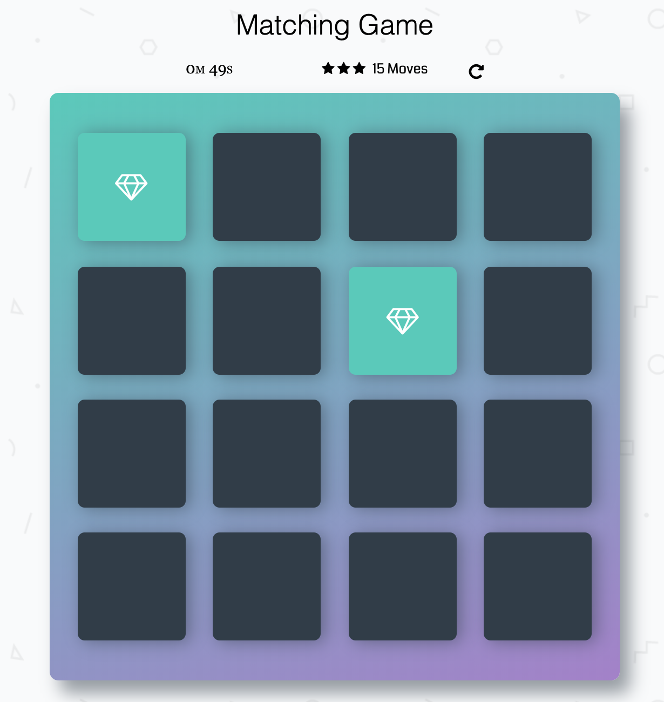

# Memory Game Project

## Table of Contents

- [What is the Memory Game](#What_is_the_Memory_Game)
- [Challenge](#Challenge)
- [How to Play](#How_to_Play)
- [Instructions](#instructions)
- [How I built the Memory Game](#How_I_built_the_Memory_Game)
- [Contributing](#contributing)

## What is the Memory Game

This is a simple game built to test a users memory. There's a deck of cards with different icons.

## Challenge

Match cards in less time with less moves.

## How to Play

Click the link below and load the game:
https://malhussaini.github.io/Memory_Game/

## Instructions

- On start all card will be revealed.
- Click on a card
- Keep revealing cards and working your memory to remember each unveiled card.
- Match cards properly with less moves and in faster time

## How I built the Memory Game

I manipulated the DOM with Vanilla JS, and also have altered part of the HTML and the style of the game.

- created a deck of cards that shuffles when game is refreshed
- created a counter to count the number of moves made by player and timer to know the duration of a play
- added effects to cards when they match and are unmatched
- create a pop-up modal when player wins game

###Dependency
* [Font Awesome] (https://maxcdn.bootstrapcdn.com/font-awesome/4.6.1/css/font-awesome.min.css)
* [Google Fonts] (https://fonts.googleapis.com/css?family=Coda) 

## Contributing

The majority of the project HTML and CSS styling is taking from the udacity team repository.

This repository is encouraging and welcomes to _all_ contribution. If any, please make your pull request with clear name.

For details, check out [CONTRIBUTING.md](CONTRIBUTING.md).
